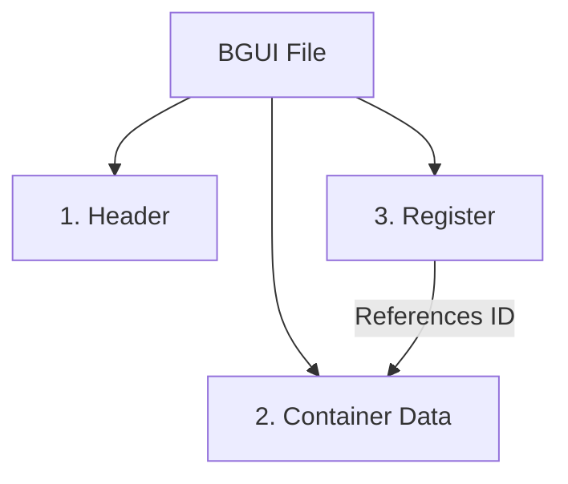

# BGUI File Format - Comprehensive Guide

This guide details the structure of `.bgui` files, using `display_camaro_gt4r.bgui` as a reference. It covers the file header, container definitions, and the register hierarchy.

**Target File**: `display_camaro_gt4r.bgui`
**Endianness**: Little-Endian (`<`)

---

## 1. High-Level Structure

A BGUI file consists of three sequential sections:

1.  **File Header**: Magic signature, Sprite references, and Page Data.
2.  **Container Definitions**: A linear sequence of UI elements (Containers), defining "what" exists (visual properties, textures).
3.  **Register**: A hierarchy table at the end of the file, defining "where" elements belong in the tree (Parent/Child relationships).



---

## 2. File Header (Complete Analysis)

The header establishes the file type, loads global resources (Sprite Sheets), and defines Page structures. The breakdown below analyzes the **entire** header block (Wraps from `0x00` to `0x178`).

### Full Header Hex Map

**Legend**:
- `[__]` : Magic / Markers
- `<__>` : Lengths
- `"__"` : Strings
- `|__|` : Values/IDs
- `....` : Unknown/Padding

```text
Offset    Hex Bytes                                        ASCII             Description
---------------------------------------------------------------------------------------------------------
00000000  [00 00 10 40] |01 00 00 00| <18> "67 75 69 5C    ...@.....gui\     Magic + SpriteFlag(1) + PathLen(24)
00000010  64 69 73 70 6C 61 79 73 70 72 69 74 65 73 36     displaysprites6   "gui\displaysprites6.bspr"
00000020  2E 62 73 70 72" [01 00 00 00 01 00 00 00] <09>   .bspr.........    Sprite Marker + StrLen(9)
00000030  "43 6F 6E 74 61 69 6E 65 72" E0 26 8B 14 01 00   Container.&.....  "Container" + Unknown Separator
00000040  00 00 00 00 00 00 00 00 00 00 00 00 00 00 44 00  ..............D.  Padding + Unknowns
00000050  00 00 44 00 00 00 00 00 00 00 00 00 00 [7A C4]   ..D..........z..  ...
00000060  00 00 [7A C4] 00 00 7A 44 00 00 7A 44 [03 00     ..z...zD..zD..    "Phantom" Container Start (Marker 03..)
00000070  00 00] <00> |03 00 00 00| |00 00 00 00| |00 00   ..............    Marker + NameLen(0) + Pad(3) + ID(0)
00000070  00 FF FF FF FF| 00 00 00 00 00 00 00 00 00 00    ................  X(-NaN/-1) ...
00000080  00 00 00 00 00 00 00 00 00 44 00 00 00 44 00     .........D...D.   ...
00000090  00 80 44 00 00 80 44 0F 00 00 00 02 00 00 00     ..D...D.........  ...
000000A0  02 00 00 00 00 00 80 3F 01 00 00 00 02 00 00     .......?........  ...
000000B0  00 <04> "70 61 67 65" 28 E1 2D F6 01 00 00 00    ....page(.-.....  Page Def: "page"
000000C0  00 00 00 00 <0A> "55 6E 61 73 73 69 67 6E 65     ..........Unassi  Page Name: "Unassigned"
000000D0  64" 3C CD 1B 9C 01 00 00 00 00 00 00 00 01 00    gned<...........  ...
000000E0  00 00 01 00 00 00 <04> "70 61 67 65" 28 E1 2D    .......page(.-..  Page Def: "page"
000000F0  F6 02 00 00 00 00 00 00 00 00 00 00 00 00 00     ................  ...
00000100  00 00 00 00 00 00 00 00 00 00 00 01 00 00 00     ................  ...
00000110  00 00 00 00 00 00 00 00 0E 00 00 00 00 00 00     ................  ...
00000120  00 00 00 00 00 00 00 00 00 00 00 00 01 00 00     ................  ...
00000130  00 <18> "66 6F 6E 74 5F 61 72 69 65 73 5F 73     ......font_aries_s  Default Font Resource
00000140  6D 61 6C 6C 5F 44 45 46 41 55 4C 54" 75 48 D8    mall_DEFAULTuH..  "font_aries_small_DEFAULT"
00000150  46 00 00 00 00 AE 47 E1 3E CD CC 0C 3F CD CC     F.....G.>...?..   ...
00000160  CC 3E D7 A3 F0 3E 8F C2 F5 3E B8 1E 05 3F 00     .>...>...>...?..  ...
00000170  00 00 FF 00 00 00 00 CD CC 0C 3F                 ...........?      End of Header Block
```

### Detailed Field Breakdown

| Offset Range | Value | Description |
| :--- | :--- | :--- |
| **0x00 - 0x2A** | (Standard Header) | **Standard file header** (Magic, Sprites). See previous section. |
| **0x33 - 0x36** | `E0 26 8B 14` | **Page Data Separator**. Marks the start of the Page Definition Block. |
| **0x63** | `03 00 00 00` | **Phantom Container Marker**. A container-like structure embedded in the header. |
| **0x67** | `00` | **Name Length** (Empty). |
| **0x68** | `03 00 00 00` | **Padding/Type**. |
| **0x6C** | `00 00 00 00` | **ID: 0**. This "Phantom" container has ID 0, but is not the Root Node in the Register. |
| **0xB4** | `04 ...` | **Page Entry 1**. String len 4: "page". |
| **0xBD** | `0A ...` | **Page Name**. String len 10: "Unassigned". |
| **0xEA** | `04 ...` | **Page Entry 2**. String len 4: "page". |
| **0x131** | `18 ...` | **Global Font Resource**. "font_aries_small_DEFAULT". |

> [!NOTE]
> This "Page Data" block (0x33 - 0x178) contains layout definitions that are not standard containers. They likely define global pages or layers (e.g., "Unassigned"). The standard container list begins immediately after this block (at `0x178` in this file).


---

## 3. Container Definitions

This is the bulk of the file. Each container is a self-contained block defining a UI element.

### Anatomy of a Container (Example: ID 4)

We will examine **Container ID 4** (`display_generic_light_off`), located at offset `0x309` in the file.

#### A. Container Header & Name

| Offset (Rel) | Hex | Encoded Value | Description |
| :--- | :--- | :--- | :--- |
| `-0x08` | `00 00 00 00`<br>`0A 00 00 00` | **Pre-Header** | Raw header bytes (Size varies). |
| **`0x00`** | `03 00 00 00` | **MARKER** | **Start of Container Block**. |
| `0x04` | `19` | **Name Len** | 25 bytes (`0x19`). |
| `0x05` | `64 69 73 ...` | **Name** | `"display_generic_light_off"` |
| `...` | `...` | | |
| `NameEnd` | `98 81 46 1E` | **Hash/Pad** | Unknown hash or padding. |

#### B. Container Body (Properties)
Located immediately after the Name and Hash.

| Offset (Rel) | Hex | Value | Description |
| :--- | :--- | :--- | :--- |
| **`+04`** | `04 00 00 00` | **ID: 4** | **CRITICAL LINK**: Matches Register ID. |
| `+08` | `00 00 80 BF` | **X: -1.0** | X Position. |
| `+0C` | `00 00 20 41` | **Y: 10.0** | Y Position. |
| `+10` | `00 00 30 42` | **Size: 44.0** | Size/Scale. |
| `+14` | `00 00 30 42` | **Color** | Color Mask (RGBA/Value). |
| `+18` | `00 ...` | **Unknown** | 44 bytes of reserved/unknown data. |
| `+64` | `BD 00 00 00` | **Res Len** | **189 bytes**. Length of Resource Block. |

#### C. Resource Block (The 189-Byte Section)

The **Resource Block** is a fixed-size structure located at `Body + 64`. It is **always 189 bytes** (`0xBD`) long. It typically contains the texture (`.dds`) or font (`.bfont`) path.

**Hex Map Example (from `display_generic_light_off`)**
start offset: `0x373`

```text
Offset    Hex Bytes                                        ASCII             Description
-------------------------------------------------------------------------------------------------------
00000373  [BD 00 00 00] [00 01 00 00 00] <1D> "64 69 73    .............dis  TotalLen(189) + Flags(5) + StrLen(29)
00000380  70 6C 61 79 5F 67 65 6E 65 72 69 63 5F 6C 69     play_generic_li   "display_generic_li...
00000390  67 68 74 5F 6F 66 66 2E 64 64 73" 00 00 00 00    ght_off.dds.....  ...ght_off.dds" + Padding Start
000003A0  00 00 00 00 80 3F 00 00 80 3F 00 00 00 00 00     .....?...?.....   Padding / Garbage Data...
000003B0  00 00 00 00 00 00 00 00 00 00 00 00 00 00 00     ...............   ...
...       (Padding continues for remainder of 189 bytes)
00000430  (Next Container Marker usually follows shortly after)
```

**Structure Breakdown**:

| Offset (Rel) | Size | Example | Description |
| :--- | :--- | :--- | :--- |
| **`+0`** | `u32` | `BD 00 00 00` | **Block Length**. Always 189 (`0xBD`). |
| **`+4`** | `u8[5]` | `00 01 00 00 00` | **Flags**. Standard pattern seen in almost all files. |
| **`+9`** | `u8` | `1D` (29) | **Inner String Length**. Length of the resource path. |
| **`+10`** | `char[]` | `"display..dds"` | **Resource Path**. The actual string. |
| **`+10+N`** | `bytes` | `00...` | **Padding**. Fills the remainder of the 189-byte block. |

> [!IMPORTANT]
> Because this block is fixed at 189 bytes, usually there is significant padding after the string. The next container marker will be found strictly after `Start + 189` bytes.

#### D. Detailed Container Example (RPMbarContainer)

Here is a breakdown of a container (`RPMbarContainer`) and its first child (`RPMbar1`) from `display_camaro_gt4r.bgui` (offsets `0xC80` - `0xE20`).

**Hex Map: RPMbarContainer (Parent)**

```text
Offset    Hex Bytes                                        Description
-----------------------------------------------------------------------------------------
00000C80  3F 00 00 00 ... 00 00 00 00 [03 00 00 00] <0F>   Pre-header + Marker + NameLen(15)
00000CA0  "52 50 4D 62 61 72 43 6F 6E 74 61 69 6E 65 72"   "RPMbarContainer"
00000CB0  75 E0 FF 44                                      Padding/Hash (4 bytes or 3+offset?)
00000CB0  |0E 00 00 00| |00 00 60 41| |00 48 43 00|        ID(14) X(14.0) Y(200.0) 
00000CC0  |00 80 F0 43| |00 00 3F 43| ...                  Size(481.0) Color(191.0?)
...       (Unknown Data 44 bytes)
00000CF0  ... [BD 00 00 00] 00 01 00 00 00 ...             Resource Len (189) + Flags
```

**Field Breakdown (Parent)**:
*   **Marker**: `03 00 00 00` at `0xC9A`.
*   **Name**: "RPMbarContainer" (15 bytes).
*   **Body Start (ID)**: `0E` at `0xCB1` (ID = 14).
*   **X**: `14.0` (`00 00 60 41`).
*   **Y**: `200.0` (`00 48 43 00`). note: in this dump context, `00484300` looks like `00 00 43 48` LE.
*   **Resource**: Length 189 at `0xCF1` (`CB1` + 64).

**Hex Map: RPMbar1 (Child)**

```text
Offset    Hex Bytes                                        Description
-----------------------------------------------------------------------------------------
00000D60  ... [03 00 00 00] <07> "52 50 4D 62 61 72 31"    Marker + Len(7) + "RPMbar1"
00000D70  E2 E9 B2 |0F 00 00 00| |00 00 70 41|             Pad(3) + ID(15) + X(15.0)
00000D80  |00 00 7C 42| |00 00 20 41| |00 00 EE 42|        Y(63.0) Size(10.0) Color(...)
```

**Field Breakdown (Child)**:
*   **Marker**: `03 00 00 00` at `0xD66`.
*   **Name**: "RPMbar1" (7 bytes).
*   **Padding**: `E2 E9 B2` (3 bytes).
*   **Body Start (ID)**: `0F` at `0xD75` (ID = 15).
*   **X**: `15.0` (`00 00 70 41`).
*   **Y**: `63.0` (`00 00 7C 42`).
*   **Size**: `10.0` (`00 00 20 41`).

> [!TIP]
> The **padding** between the Name and the ID (Body Start) appears variable (often 3-4 bytes) to adjust alignment. The Body (ID) consistently starts the fixed property block.


---

## 4. The Register (Hierarchy)

The **Register** is located at the very end of the file. It defines the parent-child relationships.

**Location**: Scan backwards from End-of-File for signature `0E 00 00 ...`.

### Relationship Explained
The "Container Data" section is just a flat list of items. The "Register" tells the game how to assemble them into a tree.

-   **Link**: `Register Entry ID` <--> `Container Body ID`
-   **Structure**: Each Register ID has a `Child Count`.
-   **Algorithm**: The tree is built using a **Pre-Order Traversal** (Stack-based) logic.
    -   Items appear in the Register/Container list in the order they should be attached to the tree.
    -   If a node has `Child Count > 0`, it becomes the parent for the *next* `N` items.

### Register Hex Dump (Example from ID 14 & 15)

This section of the register corresponds to the `RPMbarContainer` (ID 14) we examined earlier.

```text
Offset    Hex Bytes                                Description
-----------------------------------------------------------------------------------
00005EEE  |0E 00 00 00| |50 00 00 00|              ID: 14 (RPMbarContainer), Count: 80
00005EF6  |0F 00 00 00| |00 00 00 00|              ID: 15 (RPMbar1), Count: 0
00005EFE  |10 00 00 00| ...                        ID: 16 ...
```

### Relationship Logic

1.  **ID 14 (`RPMbarContainer`)**:
    *   Has a **Child Count of `0x50` (80)**.
    *   This count refers to **Immediate Children** (Direct Descendants).

2.  **Sequential Consumption (The "Grandchild" Factor)**:
    *   Because the file is linear (Pre-Order), if a child node *also* has children, they appear immediately after it.
    *   **Example from this file**:
        *   ID 14 starts at index 14.
        *   It claims **80** children.
        *   The range of IDs involved is **ID 15 to ID 104** (Total 90 items).
        *   **Why 90 IDs for 80 Children?**
            *   In this block, there are **5 specific nodes** (IDs 81, 85, 89, 93, 97) that *each* have 2 children of their own.
            *   `80 (Direct) + 5 * 2 (Grandchildren) = 90 IDs`.
    *   This confirms that the "Child Count" strictly tracks the number of direct sub-nodes, while the ID sequence simply increments for every node defined in the file.

3.  **Leaf Logic (ID 15)**:
    *   ID 15 (`RPMbar1`) has a child count of `0`.
    *   It effectively "consumes" 1 slot in the parent's count and 0 additional IDs from the sequence.

### Linking It All Together

*   **Container Block**: Defines the properties (ID 14 = Parent, ID 15 = Leaf...).
*   **Register**: Defines the Tree Topology. To parse the tree, you must read the Register sequentially and maintain a stack of "Remaining Children" for the current parent.

---

## 5. Visual Summary of File Layout

```text
[ FILE START ]
+-------------------------------------------------------+
| HEADER (Magic, Sprites, Page Data)                    |
+-------------------------------------------------------+
| CONTAINER 0 (ID=2)                                    |
|   [ Marker | Name | Pad | ID:2 | Props | Resource... ]|
+-------------------------------------------------------+
| CONTAINER 1 (ID=3)                                    |
|   [ Marker | Name | Pad | ID:3 | Props | Resource... ]|
+-------------------------------------------------------+
| ...                                                   |
+-------------------------------------------------------+
| CONTAINER N                                           |
+-------------------------------------------------------+
| REGISTER (End of File)                                |
|   [ Sig | ID:0, Count | ID:1, Count | ... ]           |
+-------------------------------------------------------+
[ FILE END ]
```
