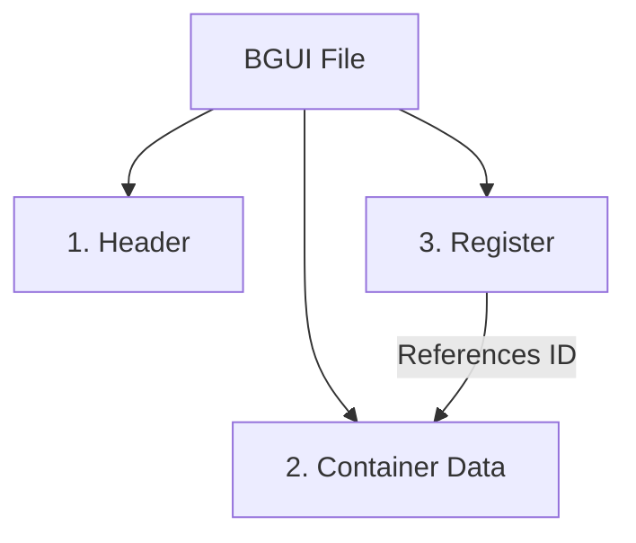

# BGUI File Format - Comprehensive Guide

This guide details the structure of `.bgui` files, using `display_camaro_gt4r.bgui` as a reference. It covers the file header, container definitions, and the register hierarchy.

**Target File**: `display_camaro_gt4r.bgui`
**Endianness**: Little-Endian (`<`)

---

## 1. High-Level Structure
1.  **File Header**: Magic signature, Sprite references (01), and Global Project Container (01).
2.  **Manifest (Container 0)**: String table defining names for subsequent containers.
3.  **Container Data**: Linear sequence of standard UI elements (03/04).
4.  **Register**: Hierarchy table at the end (Pre-Order Tree).



---

### 2. Header Markers `01 00 00 00`
It appears the file header often contains two distinct `01` markers before the standard `03/04` containers begin.

**Marker 1: Sprite Pointer**
- **Type**: `01 00 00 00`
- **Content**: A string ending in `.bspr` (e.g., `gui\displaysprites6.bspr`).
- **Role**: Defines the sprite sheet used by the file.
- **Parser Logic**: Treated as a header property (`Sprite Path`). It is generally NOT registered as a container in the tree (or is strictly a property).

**Marker 2: Project Container (ID:1)**
- **Type**: `01 00 00 00` (or sometimes followed by a confirmation ID)
- **Name**: "Container"
- **Role**: This is the **Root Container** for the project logic, explicitly mapped to **Container ID 1**.
- **Tree**: It appears in the tree as `ID:1`.
- **Note**: The parser specifically looks for the string "Container" to distinguish this from the Sprite Pointer.

---

### 3. Container 0: The Manifest (String Table)
Immediately following the header (often the first `03` marker) is a special container.

- **Marker**: `03 00 00 00`
- **Name Length**: `0` (Byte at Offset + 4 is `00`)
- **ID**: `0`
- **String Count**: Located at **Offset + 5** (as a u32).
- **Content**: A list of Pascal-style strings (1-byte length followed by string).
- **Function**: Acts as a lookup table (Manifest) for page keys or shared strings.
- **Parser Logic**: Identified by `ID=0`. Children of this node in the Register are the Manifest entries.
    *   **Strings**: Sequence of `[Len (u8)] [String]` entries.
    *   **Correlation**: These strings correspond 1:1 to the Names of subsequent containers (e.g., `page1` here maps to a later container named `Page 1`).

> [!NOTE]
> This Manifest (C0) explains the "Phantom Container" noted earlier. It is a valid container (ID 0) but serves as a lookup table rather than a visual element.

### Detailed Field Breakdown

| Offset Range | Value | Description |
| :--- | :--- | :--- |
| **0x00 - 0x2A** | (Standard Header) | **Standard file header** (Magic, Sprites). See previous section. |
| **0x33 - 0x36** | `E0 26 8B 14` | **Page Data Separator**. Marks the start of the Page Definition Block. |
| **0x63** | `03 00 00 00` | **Phantom Container Marker**. A container-like structure embedded in the header. |
| **0x67** | `00` | **Name Length** (Empty). |
| **0x68** | `03 00 00 00` | **Padding/Type**. |
| **0x6C** | `00 00 00 00` | **ID: 0**. This "Phantom" container has ID 0, but is not the Root Node in the Register. |
| **0xB4** | `04 ...` | **Page Entry 1**. String len 4: "page". |
| **0xBD** | `0A ...` | **Page Name**. String len 10: "Unassigned". |
| **0xEA** | `04 ...` | **Page Entry 2**. String len 4: "page". |
| **0x131** | `18 ...` | **Global Font Resource**. "font_aries_small_DEFAULT". |

> [!NOTE]
> This "Page Data" block (0x33 - 0x178) contains layout definitions that are not standard containers. They likely define global pages or layers (e.g., "Unassigned"). The standard container list begins immediately after this block (at `0x178` in this file).


---

## 3. Container Definitions

This is the bulk of the file. Each container is a self-contained block defining a UI element.

### Anatomy of a Container (Example: ID 4)

We will examine **Container ID 4** (`display_generic_light_off`), located at offset `0x309` in the file.

#### A. Container Header & Name

| Offset (Rel) | Hex | Encoded Value | Description |
| :--- | :--- | :--- | :--- |
| `-0x08` | `00 00 00 00`<br>`0A 00 00 00` | **Pre-Header** | Raw header bytes (Size varies). |
| **`0x00`** | `03 00 00 00` | **MARKER** | **Start of Container Block**. |
| `0x04` | `19` | **Name Len** | 25 bytes (`0x19`). |
| `0x05` | `64 69 73 ...` | **Name** | `"display_generic_light_off"` |
| `...` | `...` | | |
| `NameEnd` | `98 81 46 1E` | **Hash/Pad** | Unknown

### 4. Container Structure
Containers are the main building blocks of the UI. They are stored sequentially before the Register.

#### Marker Types
- **`03 00 00 00`**: Standard Container (Image, Group, Panel)
- **`04 00 00 00`**: Text/Font Container

| Offset | Size | Type | Description |
| :--- | :--- | :--- | :--- |
| `+0` | 4 | `u32` | **Marker** (`03` or `04`) |
| `+4` | 1 | `u8` | **Name Length** |
| `+5` | N | `char` | **Name String** (ASCII) |
| `+5+N` | 4 | `bytes` | **Padding/Hash**. Usually `00`s but can contain data. |
| `+9+N` | - | - | **Body Start** (Start of `BguiContainer` struct) |

#### Body Structure (Common)
All containers appear to share the same body property layout starting after the padding:

| Body Offset | Size | Type | Description |
| :--- | :--- | :--- | :--- |
| `+0` | 4 | `u32` | **Container ID** (Referenced by Register) |
| `+4` | 4 | `float` | **X Position** |
| `+8` | 4 | `float` | **Y Position** |
| `+12` | 4 | `float` | **Width/Size** |
| `...` | ... | ... | ... |
| `Ends` | 4 | `u32` | **00 00 80 3F** marker (1.0f) near end |

#### B. Container Body (Properties)
Located immediately after the Name and Hash.

| Offset (Rel) | Hex | Value | Description |
| :--- | :--- | :--- | :--- |
| **`+04`** | `04 00 00 00` | **ID: 4** | **CRITICAL LINK**: Matches Register ID. |
| `+08` | `00 00 80 BF` | **X: -1.0** | X Position. |
| `+0C` | `00 00 20 41` | **Y: 10.0** | Y Position. |
| `+10` | `00 00 30 42` | **Width: 44.0** | Width. |
| `+14` | `00 00 30 42` | **Height: 44.0** | Height. (Previously mistaken for Color). |
| `+18` | `00 ...` | **Unknown** | 44 bytes of reserved/unknown data. |
| `+64` | `BD 00 00 00` | **Unknown** | . Start of Resource Block.

#### C. Resource Block 

The **Resource Property** is a dynamic tagged property (`BD`) scanned within the container. The **Container Color** is stored at the end of the container, separately.

**Hex Map Example (from `display_generic_light_off`)**
start offset: `0x373`

```text
Offset    Hex Bytes                                        ASCII             Description
-------------------------------------------------------------------------------------------------------
00000373  BD 00 00 00                                      ....              Property ID = 0xBD (Resource Property)
00000377  01 00 00 01                                      ....              Property header / flags (variable, format-specific)
0000037B  1D                                               .                 Resource string length = 0x1D (29 bytes)
0000037C  64 69 73 70 6C 61 79 5F 67 65 6E 65 72 69 63     display_generic   Resource string (ASCII)
0000038C  5F 6C 69 67 68 74 5F 6F 66 66 2E 64 64 73        _light_off.dds    End of resource string (29 bytes total)
000003A9  00 00 00 00                                      ....              Padding / alignment
000003AD  80 3F                                            .?                Float 1.0 marker (LE)
000003AF  00 00                                            ..                Padding
000003B1  80 3F                                            .?                Additional float 1.0 marker
000003B3  00 00 00 00 00                                   .....             Padding / unknown container data
000003B8  00 00 00 00 00 00 00 00 00 00 00 00 00 00 00     ...............   Padding / unused bytes
000003C7  FF FF FF FF                                      ....              Unknown / sentinel value 
### 5. Hierarchical Bounds Logic
The BGUI file layout is **flat** (sequential list of containers). The hierarchy is defined purely by the **Register** at the end of the file.
- **Problem**: A container (e.g., ID:1) might be physically located in the header, while its children (ID:2...) are located thousands of bytes later, separated by other containers (like the Manifest).
- **Solution**: To correctly highlight a container's "bounds", one must calculate the **Min Start** and **Max End** of **all containers in its logical subtree**.
    - `Start = Min(MarkerOffset of all descendants)`
    - `End = Max(EndOffset of all descendants)`
...       ...
000003E0  00 00 00 00 00 FF FF FF FF  00 00 80 3F 00 00 00 00   ...........?....  **Container Colour**: RGB stored at offsets `0x3E6–0x3E8` (three bytes immediately before the final `00 00 80 3F` marker, little-endian float `1.0`), which terminates the colour definition for this container.
...       ...                                              ...               Padding / additional container data
00000430  (Next container marker typically follows nearby)                   End of this container’s data region
```

**Structure Breakdown**:

| Offset (Rel) | Size | Example | Description |
| :--- | :--- | :--- | :--- |
| **`+0`** | `u32` | `BD 00 00 00` | **Tag Property**. Tag `BD` (Dynamic Size). |
| **`+4`** | `varies` | `00 01 ...` | **Header/Flags**. Variable Size. |
| **`+9`** | `u8` | `1D` (29) | **Inner String Length**. |
| **`+10`** | `char[]` | `"display.."` | **Resource Path**. |
| **`+10+N`** | `bytes` | `00...` | **Padding**. |

> [!IMPORTANT]
> **Color Location Rule**: The Color is **NOT** at a fixed offset. It must be found by searching **BACKWARDS** from the **End of the Container** (defined by the next marker) for the `00 00 80 3F` marker.
>
> **Color is the 3 bytes (RGB) immediately BEFORE this marker.**
>
> There are multiple `00 00 80 3F` markers in a container - the **LAST** one (closest to container end) has the color.
>
> Example hex pattern (from container ID 15 at 0xE00):
> ```
> ... FF D3 9F 10 00 00 80 3F ...
>        ^^^^^^^^ ^^^^^^^^^^^
>        RGB      1.0f marker
> ```
>
> The parser searches **backwards** (using `rfind`) within the container body for `00 00 80 3F` and reads the 3 preceding bytes as R, G, B.

#### D. Detailed Container Example (RPMbarContainer)

Here is a breakdown of a container (`RPMbarContainer`) and its first child (`RPMbar1`) from `display_camaro_gt4r.bgui` (offsets `0xC80` - `0xE20`).

**Hex Map: RPMbarContainer (Parent)**

```text
Offset    Hex Bytes                                        Description
-----------------------------------------------------------------------------------------
00000C80  3F 00 00 00 ... 00 00 00 00 [03 00 00 00] <0F>   Pre-header + Marker + NameLen(15)
00000CA0  "52 50 4D 62 61 72 43 6F 6E 74 61 69 6E 65 72"   "RPMbarContainer"
00000CB0  75 E0 FF 44                                      Padding/Hash (4 bytes or 3+offset?)
00000CB0  |0E 00 00 00| |00 00 60 41| |00 48 43 00|        ID(14) X(14.0) Y(200.0) 
00000CC0  |00 80 F0 43| |00 00 3F 43| ...                  Size(481.0) Color(191.0?)
...       (Unknown Data 44 bytes)
00000CF0  ... [BD 00 00 00] 00 01 00 00 00 ...             Resource Len (189) + Flags
```

**Field Breakdown (Parent)**:
*   **Marker**: `03 00 00 00` at `0xC9A`.
*   **Name**: "RPMbarContainer" (15 bytes).
*   **Body Start (ID)**: `0E` at `0xCB1` (ID = 14).
*   **X**: `14.0` (`00 00 60 41`).
*   **Y**: `200.0` (`00 48 43 00`). note: in this dump context, `00484300` looks like `00 00 43 48` LE.
*   **Resource**: Length 189 at `0xCF1` (`CB1` + 64).

**Hex Map: RPMbar1 (Child)**

```text
Offset    Hex Bytes                                        Description
-----------------------------------------------------------------------------------------
00000D60  ... [03 00 00 00] <07> "52 50 4D 62 61 72 31"    Marker + Len(7) + "RPMbar1"
00000D70  E2 E9 B2 |0F 00 00 00| |00 00 70 41|             Pad(3) + ID(15) + X(15.0)
00000D80  |00 00 7C 42| |00 00 20 41| |00 00 EE 42|        Y(63.0) Size(10.0) Color(...)
```

**Field Breakdown (Child)**:
*   **Marker**: `03 00 00 00` at `0xD66`.
*   **Name**: "RPMbar1" (7 bytes).
*   **Padding**: `E2 E9 B2` (3 bytes).
*   **Body Start (ID)**: `0F` at `0xD75` (ID = 15).
*   **X**: `15.0` (`00 00 70 41`).
*   **Y**: `63.0` (`00 00 7C 42`).
*   **Size**: `10.0` (`00 00 20 41`).

> [!TIP]
> The **padding** between the Name and the ID (Body Start) appears variable (often 3-4 bytes) to adjust alignment. The Body (ID) consistently starts the fixed property block.


---

## 4. The Register (Hierarchy)

The **Register** is located at the very end of the file. It defines the parent-child relationships.

**Location**: Scan backwards from End-of-File for signature `0E 00 00 ...`.

### Relationship Explained
The "Container Data" section is just a flat list of items. The "Register" tells the game how to assemble them into a tree.

-   **Link**: `Register Entry ID` <--> `Container Body ID`
-   **Structure**: Each Register ID has a `Child Count`.
-   **Algorithm**: The tree is built using a **Pre-Order Traversal** (Stack-based) logic.
    -   Items appear in the Register/Container list in the order they should be attached to the tree.
    -   If a node has `Child Count > 0`, it becomes the parent for the *next* `N` items.

### Register Hex Dump (Example from ID 14 & 15)

This section of the register corresponds to the `RPMbarContainer` (ID 14) we examined earlier.

```text
Offset    Hex Bytes                                Description
-----------------------------------------------------------------------------------
00005EEE  |0E 00 00 00| |50 00 00 00|              ID: 14 (RPMbarContainer), Count: 80
00005EF6  |0F 00 00 00| |00 00 00 00|              ID: 15 (RPMbar1), Count: 0
00005EFE  |10 00 00 00| ...                        ID: 16 ...
```

### Relationship Logic

1.  **ID 14 (`RPMbarContainer`)**:
    *   Has a **Child Count of `0x50` (80)**.
    *   This count refers to **Immediate Children** (Direct Descendants).

2.  **Sequential Consumption (The "Grandchild" Factor)**:
    *   Because the file is linear (Pre-Order), if a child node *also* has children, they appear immediately after it.
    *   **Example from this file**:
        *   ID 14 starts at index 14.
        *   It claims **80** children.
        *   The range of IDs involved is **ID 15 to ID 104** (Total 90 items).
        *   **Why 90 IDs for 80 Children?**
            *   In this block, there are **5 specific nodes** (IDs 81, 85, 89, 93, 97) that *each* have 2 children of their own.
            *   `80 (Direct) + 5 * 2 (Grandchildren) = 90 IDs`.
    *   This confirms that the "Child Count" strictly tracks the number of direct sub-nodes, while the ID sequence simply increments for every node defined in the file.

3.  **Leaf Logic (ID 15)**:
    *   ID 15 (`RPMbar1`) has a child count of `0`.
    *   It effectively "consumes" 1 slot in the parent's count and 0 additional IDs from the sequence.

### Linking It All Together

*   **Container Block**: Defines the properties (ID 14 = Parent, ID 15 = Leaf...).
*   **Register**: Defines the Tree Topology. To parse the tree, you must read the Register sequentially and maintain a stack of "Remaining Children" for the current parent.

---

## 5. Visual Summary of File Layout

```text
[ FILE START ]
+-------------------------------------------------------+
| HEADER (Magic, Sprites, Page Data)                    |
+-------------------------------------------------------+
| CONTAINER 0 (ID=2)                                    |
|   [ Marker | Name | Pad | ID:2 | Props | Resource... ]|
+-------------------------------------------------------+
| CONTAINER 1 (ID=3)                                    |
|   [ Marker | Name | Pad | ID:3 | Props | Resource... ]|
+-------------------------------------------------------+
| ...                                                   |
+-------------------------------------------------------+
| CONTAINER N                                           |
+-------------------------------------------------------+
| REGISTER (End of File)                                |
|   [ Sig | ID:0, Count | ID:1, Count | ... ]           |
+-------------------------------------------------------+
[ FILE END ]
```
