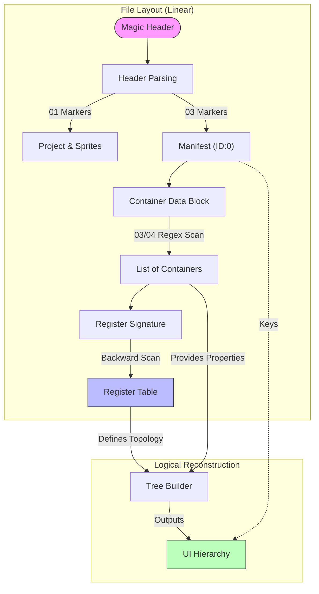

# AMS2 Engine BGUI Editor & Parser
## Overview
This project provides a robust reverse-engineering toolkit for `.bgui` user interface files used by the **Madness Engine** (notably *Project CARS 2*, *Automobilista 2*, etc.). 
The toolkit consists of a **Parser** (`bgui_parser.py`) and a visual **Register Viewer** (`register_viewer.py`) designed to deconstruct, analyze, and visualize the complex hierarchical structure of these binary UI definitions.
## 🛠 Features
### Core Parsing Engine
- **Robustness**: Uses heuristic scanning (Regex & Backward-Search) to recover data even from files with non-standard layouts.
- **Header Analysis**: Correctly interprets `01` markers for Sprite Pointers (`.bspr`) and the Project Root (Container ID 1).
- **Manifest Decoding**: Parses the internal "Manifest" (Container 0) to extract string tables used for page lookups.
- **Dynamic Property Extraction**: 
  - **Resources**: Locates variable-length `BD`-tagged properties (Textures, Fonts).
  - **Colors**: Implements a "floating" scanner to find RGBA values defined by the `1.0f` signature at the end of containers.
### Visual Inspector
- **Hierarchy Tree**: Reconstructs the exact parent-child relationships from the file's Register.
- **Dual-View Inspection**: 
  - **Tree View**: Browse the logical structure.
  - **Hex View**: See the raw underlying bytes with **precise subtree highlighting**.
- **Deep Linking**: Selecting a node instantly highlights its header, body, and all descendant containers in the hex view.
---
## 📊 Structural Analysis
The `.bgui` format is unique in that it separates the **Logical Hierarchy** from the **Physical Layout**. The flowchart below illustrates how the parser bridges this gap:

### Parsing Strategy
1.  **Register Discovery**: The parser scans *backwards* from the end of the file to find the `0E 00...` signature, which defines the hierarchy table.
2.  **Container Extraction**: Independent of the register, the file is scanned via Regex for `03` (Standard) and `04` (Text) markers to locate all UI elements.
3.  **Header Resolution**: The start of the file is parsed manually to extract the Project Name and Manifest Strings.
4.  **Reconciliation**: The logical tree (from Register) is hydrated with data from the extracted containers.
---
## 🚀 Usage
### Requirements
- **Python 3.8+**
- **Tkinter** (Usually included with Python)
### Running the Viewer
To inspect a file, simply run the viewer script. You can pass a file path as an argument or open it via the GUI.
```bash
# Launch the viewer
python register_viewer.py
# Launch and immediately open a file
python register_viewer.py "path/to/display_camaro_gt4r.bgui"
```
## 📂 File Structure Summary
| Section | Marker | Description |
| :--- | :--- | :--- |
| **Header** | `00 00 10 40` | File Magic. Contains Sprite Pointers (`01`) and Project Root (`01`). |
| **Manifest** | `03 ... 00` | **Container 0**. Acts as a string lookup table for the file. |
| **Containers** | `03` / `04` | The actual UI elements (Images, Groups, Text). |
| **Register** | `0E 00...` | Located at EOF. Defines the parent/child tree structure. |
*For a complete reverse-engineering reference, consult `BGUI_Format_Guide.md` included in this repository.*
